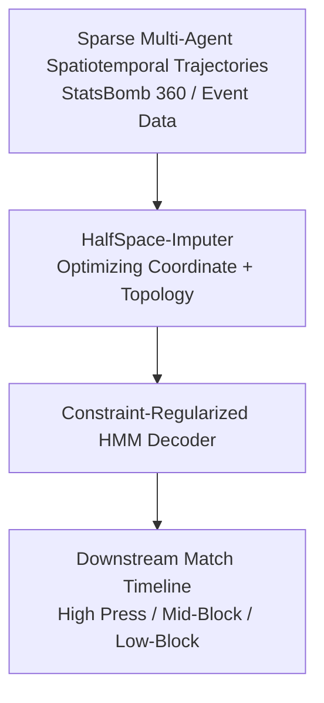
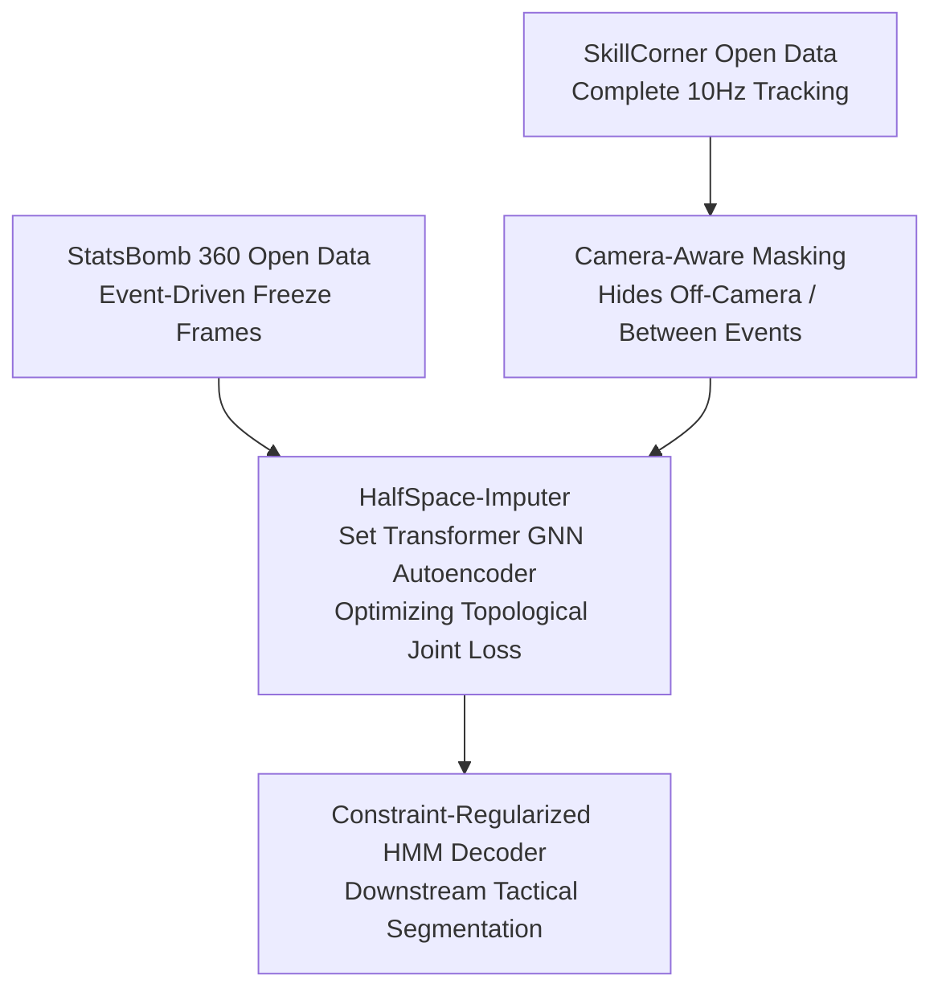

# HalfSpace: Product Requirement Document (PRD)

**Project Core:** Topology-Preserving Trajectory Reconstruction and Downstream Tactical Phase Segmentation

**Development Paradigm:** 0₹ / Open-Source and Open-Data

## 1. Executive Summary and Intent

### 1.1 Objective

**HalfSpace** is a spatiotemporal machine learning framework designed to reconstruct continuous multi-player tracking data from highly sparse, event-driven observation windows, such as StatsBomb 360 freeze-frames, and classify dynamic team-level tactical states.

### 1.2 Core Thesis

Standard spatial imputation models minimize pointwise Euclidean displacement, which often leads to “mean collapse,” where predicted coordinates drift toward the centroid under uncertainty. HalfSpace instead optimizes a joint multi-task loss that penalizes deformation of the team’s collective shape, so reconstructed player positions preserve tactical topology such as defensive line height, team width, compactness, and boundary structure.



## 2. Mathematical Specification and Loss Formulations

The optimization objective minimizes a composite loss over the predicted player coordinate matrix \(\hat{\mathbf{P}}_t \in \mathbb{R}^{N \times 2}\) relative to the ground-truth coordinate matrix \(\mathbf{P}_t \in \mathbb{R}^{N \times 2}\) for \(N\) outfield players at frame \(t\):

\[
\mathcal{L}_{\text{total}} = w_1 \mathcal{L}_{\text{MSE}} + w_2 \mathcal{L}_{\text{centroid}} + w_3 \mathcal{L}_{\text{shape}} + w_4 \mathcal{L}_{\text{boundary}}
\]

### 2.1 Coordinate Identity Loss

Standard Mean Squared Error forces reconstructed positions to align with observed targets:

\[
\mathcal{L}_{\text{MSE}} = \frac{1}{N} \sum_{i=1}^{N} \lVert \mathbf{p}_{i,t} - \hat{\mathbf{p}}_{i,t} \rVert^2
\]

### 2.2 Centroid Consistency Loss

This term prevents global drift of the reconstructed team’s center of mass:

\[
\mathcal{L}_{\text{centroid}} = \lVert \mathbf{c}_t - \hat{\mathbf{c}}_t \rVert^2 \quad \text{where} \quad \mathbf{c}_t = \frac{1}{N} \sum_{i=1}^{N} \mathbf{p}_{i,t}
\]

### 2.3 Spatial Dispersion and Aspect Ratio Loss

This preserves lateral team width and longitudinal block height without relying on static player identity indexing or alignment. The spatial covariance matrix \(\mathbf{\Sigma}_t \in \mathbb{R}^{2 \times 2}\) is defined as:

\[
\mathbf{\Sigma}_t = \frac{1}{N} (\mathbf{P}_t - \mathbf{1}\mathbf{c}_t^T)^T (\mathbf{P}_t - \mathbf{1}\mathbf{c}_t^T)
\]

Let \(\lambda_{1,t}\) and \(\lambda_{2,t}\), with \(\lambda_{1,t} \geq \lambda_{2,t}\), be the eigenvalues of \(\mathbf{\Sigma}_t\). These represent variance along the principal axes of the team’s spatial footprint. The shape loss is:

\[
\mathcal{L}_{\text{shape}} = (\lambda_{1,t} - \hat{\lambda}_{1,t})^2 + (\lambda_{2,t} - \hat{\lambda}_{2,t})^2
\]

### 2.4 Differentiable Soft Convex Hull Loss

Standard convex hull algorithms rely on discrete vertex selection and are therefore non-differentiable. HalfSpace introduces a differentiable alternative using **Softmax Radial Projections**.

Let \(\mathbf{u}_{\theta} = [\cos\theta, \sin\theta]^T\) be a unit direction vector for \(M\) discrete angular sectors, for example \(M=8\) with \(\theta \in \{0, \frac{\pi}{4}, \frac{\pi}{2}, \dots\}\). Let the relative coordinate vector of player \(i\) from the centroid be \(\mathbf{r}_{i,t} = \mathbf{p}_{i,t} - \mathbf{c}_t\). The soft maximum projection distance \(\tilde{r}_{\theta,t}\) in direction \(\theta\) is defined using a log-sum-exp operator with smoothness parameter \(\epsilon > 0\):

\[
\tilde{r}_{\theta,t} = \epsilon \log \sum_{i=1}^{N} \exp \left( \frac{\mathbf{r}_{i,t}^{T} \mathbf{u}_{\theta}}{\epsilon} \right)
\]

The boundary loss is then:

\[
\mathcal{L}_{\text{boundary}} = \frac{1}{M} \sum_{\theta=1}^{M} \left( \tilde{r}_{\theta,t} - \hat{\tilde{r}}_{\theta,t} \right)^2
\]

## 3. Gradient Legitimacy and Differentiability Proof

To validate that \(\mathcal{L}_{\text{boundary}}\) is a mathematically sound objective for backpropagation, the analytical gradient is derived with respect to any individual player coordinate vector \(\mathbf{p}_{i,t}\).

Let the scalar projection of player \(i\) relative to the centroid in direction \(\mathbf{u}_{\theta}\) be:

\[
f_i = \mathbf{r}_i^T \mathbf{u}_{\theta} = (\mathbf{p}_i - \mathbf{c})^T \mathbf{u}_{\theta}
\]

The target derivative is:

\[
\frac{\partial \tilde{r}_{\theta}}{\partial \mathbf{p}_i}
\]

### 3.1 Chain Rule Application

Applying the multivariate chain rule across all projection states gives:

\[
\frac{\partial \tilde{r}_{\theta}}{\partial \mathbf{p}_i} = \sum_{j=1}^{N} \frac{\partial \tilde{r}_{\theta}}{\partial f_j} \frac{\partial f_j}{\partial \mathbf{p}_i}
\]

### 3.2 Log-Sum-Exp Derivative

The derivative of the log-sum-exp function with respect to its \(j\)-th exponent input is:

\[
\frac{\partial \tilde{r}_{\theta}}{\partial f_j} = \frac{\partial}{\partial f_j} \left[ \epsilon \log \sum_{k=1}^{N} \exp \left( \frac{f_k}{\epsilon} \right) \right] = \frac{\exp \left( \frac{f_j}{\epsilon} \right)}{\sum_{k=1}^{N} \exp \left( \frac{f_k}{\epsilon} \right)} = w_j
\]

where \(w_j \in (0,1)\) is the standard softmax weight of player \(j\)’s projection in direction \(\theta\).

### 3.3 Projection Gradient

Because the relative projection is defined as:

\[
f_j = \left( \mathbf{p}_j - \frac{1}{N}\sum_{m=1}^{N} \mathbf{p}_m \right)^T \mathbf{u}_{\theta}
\]

its derivative with respect to \(\mathbf{p}_i\) is:

\[
\frac{\partial f_j}{\partial \mathbf{p}_i} = \mathbf{u}_{\theta} \left( \delta_{ij} - \frac{1}{N} \right)
\]

where \(\delta_{ij}\) is the Kronecker delta.

### 3.4 Analytical Vector Gradient

Substituting into the chain rule expression yields:

\[
\frac{\partial \tilde{r}_{\theta}}{\partial \mathbf{p}_i} = \sum_{j=1}^{N} w_j \mathbf{u}_{\theta} \left( \delta_{ij} - \frac{1}{N} \right) = \mathbf{u}_{\theta} \left( w_i - \frac{1}{N}\sum_{j=1}^{N} w_j \right)
\]

Since \(\sum_{j=1}^{N} w_j = 1\), the gradient simplifies to:

\[
\frac{\partial \tilde{r}_{\theta}}{\partial \mathbf{p}_i} = \mathbf{u}_{\theta} \left( w_i - \frac{1}{N} \right)
\]

### 3.5 Validation Findings

- **Continuity:** The gradient \(\frac{\partial \tilde{r}_{\theta}}{\partial \mathbf{p}_i}\) is infinitely continuous for all \(\epsilon > 0\), with no sorting operations or non-differentiable vertex selection.
- **Physical interpretation:** The gradient creates a localized outward pull on players close to the boundary, scaled by \(w_i\), balanced by a global contraction term \(-\frac{1}{N}\). This gives a stable and interpretable training signal.

## 4. Technical Pipeline Architecture

The end-to-end data and model pipeline executes across three primary stages under a strict 0₹ open-data architecture.



### 4.1 Input Specification and Ingestion

| Dataset Source | Modality | Sample Rate | Licensing / Cost |
|---|---|---|---|
| StatsBomb Open Data | Event JSON with 360 freeze-frames | Event-based sparse coordinates | Free / Open / 0₹ |
| SkillCorner Open Data | Continuous broadcast-derived tracking | 10Hz multi-agent coordinates | Free / Open / 0₹ |

### 4.2 Camera-Aware Masking and Simulation

To evaluate the imputer against ground-truth tracking, complete tracking data is artificially masked to simulate real broadcast constraints:

1. Ingest continuous tracking coordinates from the SkillCorner open dataset.
2. Isolate the ball coordinate \((x_{\text{ball},t}, y_{\text{ball},t})\) at each timestamp.
3. Apply a \(60 \times 40\) meter bounding box centered on \((x_{\text{ball},t}, y_{\text{ball},t})\) to simulate a standard broadcast camera view.
4. Set coordinates of players outside this bounding box to `NaN`.
5. Mask all frames between major on-ball events to replicate StatsBomb 360 sparsity.

### 4.3 Reconstruction Engine

- **Backbone:** A GNN-based Set Transformer Autoencoder that models spatiotemporal multi-agent interactions in an equivariant and permutation-invariant manner.
- **Loss operator:** Uses the topological joint loss \(\mathcal{L}_{\text{total}}\) to reconstruct masked coordinates back into a continuous 2D pitch field.

### 4.4 Downstream Tactical Segmenter

A first-order, non-homogeneous Hidden Markov Model decodes the latent sequence of tactical states:

\[
z_t \in \{\text{High Press}, \text{Mid-Block}, \text{Low-Block}, \text{Transition}\}
\]

- **Emissions:** Computed from reconstructed features \(\mathbf{x}_t = [\text{line\_height}_t, \text{compactness}_t, \text{width}_t]^T\).
- **Viterbi decoder with analyst constraints:** The transition system incorporates analyst-defined thresholds, for example forcing \(P(z_t = \text{High Press}) = 0\) when reconstructed defensive line height is below 45 meters.

## 5. Benchmarking and Empirical Validation Protocol

To satisfy rigorous academic review, the model should be validated with the following protocol.

### 5.1 Baselines

Evaluate the HalfSpace-Imputer against:

1. **ARMAX-Interpolation** — Matthew Penn’s open-source tracking interpolator.
2. **Graph Imputer** — a strong non-autoregressive GNN imputer baseline.

### 5.2 Evaluation Metrics

| Metric Group | Metric Name | Definition |
|---|---|---|
| Pointwise Spatial | Average Displacement Error (ADE) | Mean Euclidean distance between predicted and true coordinates. |
| Pointwise Spatial | Final Displacement Error (FDE) | Euclidean distance at the end of missing sequences. |
| Global Structural | Centroid Drift | Average error in team centroid location. |
| Global Structural | Compactness Error | Mean absolute difference in average radial player distance. |
| Global Structural | Boundary Deformation | Absolute difference in area of predicted and true convex hulls. |

## 6. Next Steps for Computational Processing

The following instruction block can be passed to a downstream coding system for implementation.

```text
[INSTRUCTION FOR SYSTEM SELECTION]
Please process the mathematical formulations specified in Section 2 and Section 3. Use them to generate:
1. A fully documented PyTorch implementation of the `SoftRadialHullLoss` module.
2. A simulated camera masking script using the `SkillCorner/opendata` schema to construct simulated training and test sets.
3. An ablation testing suite evaluating downstream HMM tactical classification performance on coordinate-only vs. topology-preserving trajectories.
```
