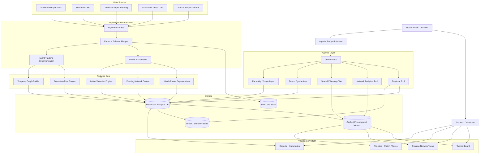
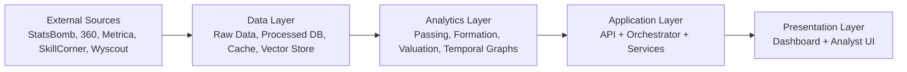
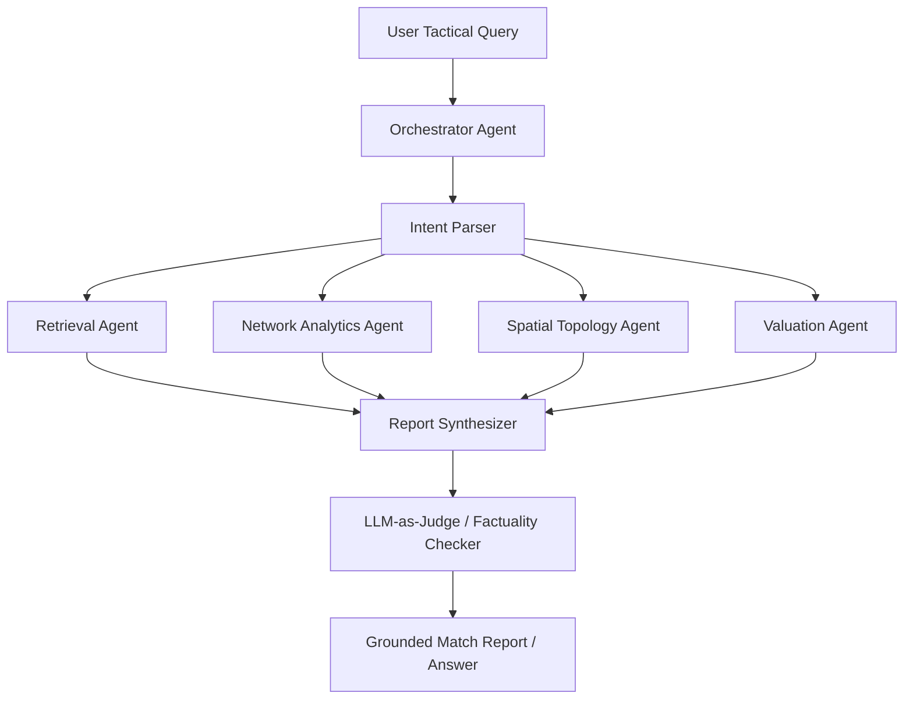
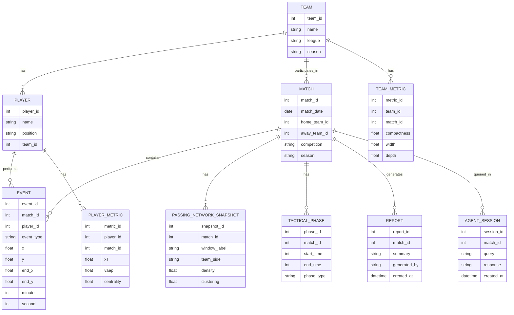

Below is your **master blueprint**. It is designed to be strong enough for final-year execution, publication-oriented refinement, and clean resume splitting. The audit strongly supports an event-first, tracking-aware hybrid architecture, but also warns that the research contribution must go beyond “dashboard + chatbot” and be grounded in clear analytical or mathematical components. [ppl-ai-file-upload.s3.amazonaws](https://ppl-ai-file-upload.s3.amazonaws.com/web/direct-files/attachments/50087095/c6f87782-ab7b-4884-ac43-7d54c0e2cce2/Football-AI-Project-Research-Audit.pdf)

## Project identity

**Primary title:** Hybrid Football Tactical Intelligence Platform with Explainable Agentic Match Analysis. [ppl-ai-file-upload.s3.amazonaws](https://ppl-ai-file-upload.s3.amazonaws.com/web/direct-files/attachments/50087095/c6f87782-ab7b-4884-ac43-7d54c0e2cce2/Football-AI-Project-Research-Audit.pdf)
**Research-leaning backup title:** Learning Dynamic Spatiotemporal Graph Representations for Semantic Translation of Team Formations. [ppl-ai-file-upload.s3.amazonaws](https://ppl-ai-file-upload.s3.amazonaws.com/web/direct-files/attachments/50087095/c6f87782-ab7b-4884-ac43-7d54c0e2cce2/Football-AI-Project-Research-Audit.pdf)
**Applied backup title:** Interpretable Event-Driven Football Analytics for Tactical Visualization and Agentic Insight Generation. [ppl-ai-file-upload.s3.amazonaws](https://ppl-ai-file-upload.s3.amazonaws.com/web/direct-files/attachments/50087095/c6f87782-ab7b-4884-ac43-7d54c0e2cce2/Football-AI-Project-Research-Audit.pdf)

This title set gives you flexibility: the first is best for project presentation, the second is stronger for paper framing, and the third is useful if you want a middle ground between engineering and research language. [ppl-ai-file-upload.s3.amazonaws](https://ppl-ai-file-upload.s3.amazonaws.com/web/direct-files/attachments/50087095/c6f87782-ab7b-4884-ac43-7d54c0e2cce2/Football-AI-Project-Research-Audit.pdf)

## Problem framing

### Problem statement
Modern football analytics suffers from a semantic gap between rich but scarce spatiotemporal tracking data and widely available but sparse event streams. Existing tools often provide isolated match statistics, static passing maps, or manually interpreted tactical views, which limits understanding of how team structures, player roles, and tactical phases evolve during a match. [ppl-ai-file-upload.s3.amazonaws](https://ppl-ai-file-upload.s3.amazonaws.com/web/direct-files/attachments/50087095/c6f87782-ab7b-4884-ac43-7d54c0e2cce2/Football-AI-Project-Research-Audit.pdf)
This project aims to build an interpretable football tactical intelligence platform that extracts dynamic tactical structure from event-first data, augments it with limited tracking-aware context where available, and grounds the resulting patterns into explainable visual and agentic outputs. [ppl-ai-file-upload.s3.amazonaws](https://ppl-ai-file-upload.s3.amazonaws.com/web/direct-files/attachments/50087095/c6f87782-ab7b-4884-ac43-7d54c0e2cce2/Football-AI-Project-Research-Audit.pdf)
The system will combine passing-network analysis, formation-aware role interpretation, action valuation, interactive tactical visualizations, and an agentic analyst that answers tactical questions and produces grounded match reports. [ppl-ai-file-upload.s3.amazonaws](https://ppl-ai-file-upload.s3.amazonaws.com/web/direct-files/attachments/50087095/c6f87782-ab7b-4884-ac43-7d54c0e2cce2/Football-AI-Project-Research-Audit.pdf)

### Motivation
The audit found that this direction is meaningful, but also emphasized that a publishable contribution must be more than a polished engineering stack. The strongest contribution area is the translation of dynamic tactical structures into interpretable representations and grounded explanations rather than merely plotting football charts or wrapping an LLM around a database. [ppl-ai-file-upload.s3.amazonaws](https://ppl-ai-file-upload.s3.amazonaws.com/web/direct-files/attachments/50087095/c6f87782-ab7b-4884-ac43-7d54c0e2cce2/Football-AI-Project-Research-Audit.pdf)

## Objectives

- Build an event-first football analytics pipeline using public datasets. [ppl-ai-file-upload.s3.amazonaws](https://ppl-ai-file-upload.s3.amazonaws.com/web/direct-files/attachments/50087095/c6f87782-ab7b-4884-ac43-7d54c0e2cce2/Football-AI-Project-Research-Audit.pdf)
- Model dynamic passing and tactical structure over match phases instead of static snapshots. [ppl-ai-file-upload.s3.amazonaws](https://ppl-ai-file-upload.s3.amazonaws.com/web/direct-files/attachments/50087095/c6f87782-ab7b-4884-ac43-7d54c0e2cce2/Football-AI-Project-Research-Audit.pdf)
- Add formation-aware or role-aware tactical interpretation. [ppl-ai-file-upload.s3.amazonaws](https://ppl-ai-file-upload.s3.amazonaws.com/web/direct-files/attachments/50087095/c6f87782-ab7b-4884-ac43-7d54c0e2cce2/Football-AI-Project-Research-Audit.pdf)
- Generate interactive visual outputs such as passing networks, tactical boards, timelines, and movement-aware views. [ppl-ai-file-upload.s3.amazonaws](https://ppl-ai-file-upload.s3.amazonaws.com/web/direct-files/attachments/50087095/c6f87782-ab7b-4884-ac43-7d54c0e2cce2/Football-AI-Project-Research-Audit.pdf)
- Build an explainable agentic layer that answers questions using computed evidence, not unsupported text generation. [ppl-ai-file-upload.s3.amazonaws](https://ppl-ai-file-upload.s3.amazonaws.com/web/direct-files/attachments/50087095/c6f87782-ab7b-4884-ac43-7d54c0e2cce2/Football-AI-Project-Research-Audit.pdf)
- Structure the system so it naturally becomes three separate resume-grade projects. [ppl-ai-file-upload.s3.amazonaws](https://ppl-ai-file-upload.s3.amazonaws.com/web/direct-files/attachments/50087095/c6f87782-ab7b-4884-ac43-7d54c0e2cce2/Football-AI-Project-Research-Audit.pdf)

## Research questions

**RQ = Research Question.** [ppl-ai-file-upload.s3.amazonaws](https://ppl-ai-file-upload.s3.amazonaws.com/web/direct-files/attachments/50087095/c6f87782-ab7b-4884-ac43-7d54c0e2cce2/Football-AI-Project-Research-Audit.pdf)

### Core RQs
- **RQ1:** Can time-varying passing-network and match-phase features extracted from public event data detect meaningful tactical transitions without relying fully on continuous tracking data? [ppl-ai-file-upload.s3.amazonaws](https://ppl-ai-file-upload.s3.amazonaws.com/web/direct-files/attachments/50087095/c6f87782-ab7b-4884-ac43-7d54c0e2cce2/Football-AI-Project-Research-Audit.pdf)
- **RQ2:** Does adding formation-aware or role-aware context improve tactical interpretation and action valuation compared with event-only static summaries? [ppl-ai-file-upload.s3.amazonaws](https://ppl-ai-file-upload.s3.amazonaws.com/web/direct-files/attachments/50087095/c6f87782-ab7b-4884-ac43-7d54c0e2cce2/Football-AI-Project-Research-Audit.pdf)
- **RQ3:** Can an explainable agentic analyst generate grounded and tactically useful reports from structured football analytics outputs while reducing hallucination risk? [ppl-ai-file-upload.s3.amazonaws](https://ppl-ai-file-upload.s3.amazonaws.com/web/direct-files/attachments/50087095/c6f87782-ab7b-4884-ac43-7d54c0e2cce2/Football-AI-Project-Research-Audit.pdf)
- **RQ4:** How much additional value is gained when limited tracking-aware context is added on top of an event-first analytics pipeline? [ppl-ai-file-upload.s3.amazonaws](https://ppl-ai-file-upload.s3.amazonaws.com/web/direct-files/attachments/50087095/c6f87782-ab7b-4884-ac43-7d54c0e2cce2/Football-AI-Project-Research-Audit.pdf)

### Stretch RQs
- **RQ5:** Does dynamic role assignment improve valuation or tactical phase recognition compared with fixed role assumptions? [ppl-ai-file-upload.s3.amazonaws](https://ppl-ai-file-upload.s3.amazonaws.com/web/direct-files/attachments/50087095/c6f87782-ab7b-4884-ac43-7d54c0e2cce2/Football-AI-Project-Research-Audit.pdf)
- **RQ6:** Do constrained multi-agent workflows produce more factual football analysis than a simple single-agent retrieval flow for complex tactical questions? [ppl-ai-file-upload.s3.amazonaws](https://ppl-ai-file-upload.s3.amazonaws.com/web/direct-files/attachments/50087095/c6f87782-ab7b-4884-ac43-7d54c0e2cce2/Football-AI-Project-Research-Audit.pdf)

## Contribution claims

Your final paper/project should claim contributions at the level below, not higher than this unless experiments truly support it. [ppl-ai-file-upload.s3.amazonaws](https://ppl-ai-file-upload.s3.amazonaws.com/web/direct-files/attachments/50087095/c6f87782-ab7b-4884-ac43-7d54c0e2cce2/Football-AI-Project-Research-Audit.pdf)

- A hybrid tactical-analysis framework combining dynamic passing networks, formation-aware tactical context, and player/team descriptors. [ppl-ai-file-upload.s3.amazonaws](https://ppl-ai-file-upload.s3.amazonaws.com/web/direct-files/attachments/50087095/c6f87782-ab7b-4884-ac43-7d54c0e2cce2/Football-AI-Project-Research-Audit.pdf)
- An event-first, tracking-aware data strategy that makes advanced tactical analysis more feasible on public datasets. [ppl-ai-file-upload.s3.amazonaws](https://ppl-ai-file-upload.s3.amazonaws.com/web/direct-files/attachments/50087095/c6f87782-ab7b-4884-ac43-7d54c0e2cce2/Football-AI-Project-Research-Audit.pdf)
- A dynamic visualization layer for tactical boards, match phases, and passing structures across time. [ppl-ai-file-upload.s3.amazonaws](https://ppl-ai-file-upload.s3.amazonaws.com/web/direct-files/attachments/50087095/c6f87782-ab7b-4884-ac43-7d54c0e2cce2/Football-AI-Project-Research-Audit.pdf)
- An explainable agentic analyst that converts structured tactical states into grounded reports and Q&A outputs. [ppl-ai-file-upload.s3.amazonaws](https://ppl-ai-file-upload.s3.amazonaws.com/web/direct-files/attachments/50087095/c6f87782-ab7b-4884-ac43-7d54c0e2cce2/Football-AI-Project-Research-Audit.pdf)
- A modular portfolio architecture split into analytics engine, visualization engine, and agentic analyst. [ppl-ai-file-upload.s3.amazonaws](https://ppl-ai-file-upload.s3.amazonaws.com/web/direct-files/attachments/50087095/c6f87782-ab7b-4884-ac43-7d54c0e2cce2/Football-AI-Project-Research-Audit.pdf)

## Scope

### Final balanced scope
The audit’s best recommendation is to keep the project balanced but backend-heavy: most effort should go into data processing, tactical representation, and grounded orchestration, while the UI should be clean and sufficient rather than overbuilt. [ppl-ai-file-upload.s3.amazonaws](https://ppl-ai-file-upload.s3.amazonaws.com/web/direct-files/attachments/50087095/c6f87782-ab7b-4884-ac43-7d54c0e2cce2/Football-AI-Project-Research-Audit.pdf)

### What v1 includes
- Event data ingestion and normalization. [ppl-ai-file-upload.s3.amazonaws](https://ppl-ai-file-upload.s3.amazonaws.com/web/direct-files/attachments/50087095/c6f87782-ab7b-4884-ac43-7d54c0e2cce2/Football-AI-Project-Research-Audit.pdf)
- Passing-network computation over configurable windows. [ppl-ai-file-upload.s3.amazonaws](https://ppl-ai-file-upload.s3.amazonaws.com/web/direct-files/attachments/50087095/c6f87782-ab7b-4884-ac43-7d54c0e2cce2/Football-AI-Project-Research-Audit.pdf)
- Basic tactical phase segmentation. [ppl-ai-file-upload.s3.amazonaws](https://ppl-ai-file-upload.s3.amazonaws.com/web/direct-files/attachments/50087095/c6f87782-ab7b-4884-ac43-7d54c0e2cce2/Football-AI-Project-Research-Audit.pdf)
- Formation-aware approximation or role-aware descriptors. [ppl-ai-file-upload.s3.amazonaws](https://ppl-ai-file-upload.s3.amazonaws.com/web/direct-files/attachments/50087095/c6f87782-ab7b-4884-ac43-7d54c0e2cce2/Football-AI-Project-Research-Audit.pdf)
- Dashboard visualizations. [ppl-ai-file-upload.s3.amazonaws](https://ppl-ai-file-upload.s3.amazonaws.com/web/direct-files/attachments/50087095/c6f87782-ab7b-4884-ac43-7d54c0e2cce2/Football-AI-Project-Research-Audit.pdf)
- Single-agent or orchestrated tool-using analyst over structured outputs. [ppl-ai-file-upload.s3.amazonaws](https://ppl-ai-file-upload.s3.amazonaws.com/web/direct-files/attachments/50087095/c6f87782-ab7b-4884-ac43-7d54c0e2cce2/Football-AI-Project-Research-Audit.pdf)

### What v2 can include
- Dynamic role assignment with Hungarian matching. [ppl-ai-file-upload.s3.amazonaws](https://ppl-ai-file-upload.s3.amazonaws.com/web/direct-files/attachments/50087095/c6f87782-ab7b-4884-ac43-7d54c0e2cce2/Football-AI-Project-Research-Audit.pdf)
- CRF or Viterbi-constrained sequence parsing for tactical state transitions. [ppl-ai-file-upload.s3.amazonaws](https://ppl-ai-file-upload.s3.amazonaws.com/web/direct-files/attachments/50087095/c6f87782-ab7b-4884-ac43-7d54c0e2cce2/Football-AI-Project-Research-Audit.pdf)
- Tracking-aware enhancement using Metrica, StatsBomb 360, or SkillCorner open data. [ppl-ai-file-upload.s3.amazonaws](https://ppl-ai-file-upload.s3.amazonaws.com/web/direct-files/attachments/50087095/c6f87782-ab7b-4884-ac43-7d54c0e2cce2/Football-AI-Project-Research-Audit.pdf)
- Multi-agent split if the single-agent workflow becomes too complex. [ppl-ai-file-upload.s3.amazonaws](https://ppl-ai-file-upload.s3.amazonaws.com/web/direct-files/attachments/50087095/c6f87782-ab7b-4884-ac43-7d54c0e2cce2/Football-AI-Project-Research-Audit.pdf)

## Dataset plan

The audit recommends an event-first foundation because full public tracking data is too limited for a robust primary system. [ppl-ai-file-upload.s3.amazonaws](https://ppl-ai-file-upload.s3.amazonaws.com/web/direct-files/attachments/50087095/c6f87782-ab7b-4884-ac43-7d54c0e2cce2/Football-AI-Project-Research-Audit.pdf)

| Dataset | Role in project | Why |
|---|---|---|
| StatsBomb Open Data | Primary event-data foundation | Large public event dataset for action-level and match-level analytics.  [ppl-ai-file-upload.s3.amazonaws](https://ppl-ai-file-upload.s3.amazonaws.com/web/direct-files/attachments/50087095/c6f87782-ab7b-4884-ac43-7d54c0e2cce2/Football-AI-Project-Research-Audit.pdf) |
| StatsBomb 360 | Spatial event-context extension | Adds contextual player positions around events for richer tactical analysis.  [ppl-ai-file-upload.s3.amazonaws](https://ppl-ai-file-upload.s3.amazonaws.com/web/direct-files/attachments/50087095/c6f87782-ab7b-4884-ac43-7d54c0e2cce2/Football-AI-Project-Research-Audit.pdf) |
| Metrica sample data | Small tracking/event validation set | Good for prototyping tracking-aware ideas, but too small to be your main training source.  [ppl-ai-file-upload.s3.amazonaws](https://ppl-ai-file-upload.s3.amazonaws.com/web/direct-files/attachments/50087095/c6f87782-ab7b-4884-ac43-7d54c0e2cce2/Football-AI-Project-Research-Audit.pdf) |
| SkillCorner Open Data | Tracking-aware extension | Useful for off-ball runs and spatial context when available.  [ppl-ai-file-upload.s3.amazonaws](https://ppl-ai-file-upload.s3.amazonaws.com/web/direct-files/attachments/50087095/c6f87782-ab7b-4884-ac43-7d54c0e2cce2/Football-AI-Project-Research-Audit.pdf) |
| Wyscout Open Dataset | Generalization or validation source | Helps test whether methods transfer beyond one provider.  [ppl-ai-file-upload.s3.amazonaws](https://ppl-ai-file-upload.s3.amazonaws.com/web/direct-files/attachments/50087095/c6f87782-ab7b-4884-ac43-7d54c0e2cce2/Football-AI-Project-Research-Audit.pdf) |

### Data tooling
The audit specifically recommends standard preprocessing libraries instead of custom parsing:
- `socceraction` for SPADL conversion and action valuation workflows. [ppl-ai-file-upload.s3.amazonaws](https://ppl-ai-file-upload.s3.amazonaws.com/web/direct-files/attachments/50087095/c6f87782-ab7b-4884-ac43-7d54c0e2cce2/Football-AI-Project-Research-Audit.pdf)
- `kloppy` for tracking/event deserialization and coordinate standardization. [ppl-ai-file-upload.s3.amazonaws](https://ppl-ai-file-upload.s3.amazonaws.com/web/direct-files/attachments/50087095/c6f87782-ab7b-4884-ac43-7d54c0e2cce2/Football-AI-Project-Research-Audit.pdf)
- `databallpy` or similar synchronization helpers for merging events and positional frames where needed. [ppl-ai-file-upload.s3.amazonaws](https://ppl-ai-file-upload.s3.amazonaws.com/web/direct-files/attachments/50087095/c6f87782-ab7b-4884-ac43-7d54c0e2cce2/Football-AI-Project-Research-Audit.pdf)

## Three-project split

### Project 1
**Spatiotemporal Graph Engine / Tactical Intelligence Backend**  
This is the main AIML and data-engineering project. It handles ingestion, normalization, feature engineering, tactical descriptors, role-aware logic, and valuation computations. [ppl-ai-file-upload.s3.amazonaws](https://ppl-ai-file-upload.s3.amazonaws.com/web/direct-files/attachments/50087095/c6f87782-ab7b-4884-ac43-7d54c0e2cce2/Football-AI-Project-Research-Audit.pdf)

### Project 2
**Dynamic Passing & Formation Visualizer**  
This is the frontend/analytics-engineering project. It renders tactical boards, time-windowed passing networks, phase timelines, and interactive tactical summaries. [ppl-ai-file-upload.s3.amazonaws](https://ppl-ai-file-upload.s3.amazonaws.com/web/direct-files/attachments/50087095/c6f87782-ab7b-4884-ac43-7d54c0e2cce2/Football-AI-Project-Research-Audit.pdf)

### Project 3
**Agentic Match Analyst**  
This is the agentic AI project. It consumes the outputs of the first two systems and turns them into tactical Q&A, comparative analysis, and grounded report generation. [ppl-ai-file-upload.s3.amazonaws](https://ppl-ai-file-upload.s3.amazonaws.com/web/direct-files/attachments/50087095/c6f87782-ab7b-4884-ac43-7d54c0e2cce2/Football-AI-Project-Research-Audit.pdf)

This split is explicitly recommended in the audit as portfolio-effective because it demonstrates ML/backend, visualization/product, and LLM/agentic system strengths separately. [ppl-ai-file-upload.s3.amazonaws](https://ppl-ai-file-upload.s3.amazonaws.com/web/direct-files/attachments/50087095/c6f87782-ab7b-4884-ac43-7d54c0e2cce2/Football-AI-Project-Research-Audit.pdf)

## Architecture

### High-level architecture

This architecture reflects the event-first, tracking-aware strategy recommended in the audit and keeps the agentic layer tool-grounded rather than free-form. [ppl-ai-file-upload.s3.amazonaws](https://ppl-ai-file-upload.s3.amazonaws.com/web/direct-files/attachments/50087095/c6f87782-ab7b-4884-ac43-7d54c0e2cce2/Football-AI-Project-Research-Audit.pdf)

### Container/layer view

This is the cleanest diagram for report documentation or viva explanation. [ppl-ai-file-upload.s3.amazonaws](https://ppl-ai-file-upload.s3.amazonaws.com/web/direct-files/attachments/50087095/c6f87782-ab7b-4884-ac43-7d54c0e2cce2/Football-AI-Project-Research-Audit.pdf)

### Agentic workflow
The audit leans toward specialized agents for difficult multi-step tactical questions because spatial reasoning, graph metrics, and natural-language generation are easier to keep factual when separated. [ppl-ai-file-upload.s3.amazonaws](https://ppl-ai-file-upload.s3.amazonaws.com/web/direct-files/attachments/50087095/c6f87782-ab7b-4884-ac43-7d54c0e2cce2/Football-AI-Project-Research-Audit.pdf)
At the same time, for implementation efficiency, you should start with a simpler orchestrator and only expand if complexity justifies it. [ppl-ai-file-upload.s3.amazonaws](https://ppl-ai-file-upload.s3.amazonaws.com/web/direct-files/attachments/50087095/c6f87782-ab7b-4884-ac43-7d54c0e2cce2/Football-AI-Project-Research-Audit.pdf)

## Database entities

A simple but solid v1 schema is enough. [ppl-ai-file-upload.s3.amazonaws](https://ppl-ai-file-upload.s3.amazonaws.com/web/direct-files/attachments/50087095/c6f87782-ab7b-4884-ac43-7d54c0e2cce2/Football-AI-Project-Research-Audit.pdf)

## Methodology

### Development methodology
Do **not** use plain SDLC as the main methodology. Use:
- research framing,
- literature grounding,
- event-first prototype,
- analytical experimentation,
- iterative system build,
- evaluation,
- then documentation. [ppl-ai-file-upload.s3.amazonaws](https://ppl-ai-file-upload.s3.amazonaws.com/web/direct-files/attachments/50087095/c6f87782-ab7b-4884-ac43-7d54c0e2cce2/Football-AI-Project-Research-Audit.pdf)

### Recommended workflow
1. Literature and baseline understanding. [ppl-ai-file-upload.s3.amazonaws](https://ppl-ai-file-upload.s3.amazonaws.com/web/direct-files/attachments/50087095/c6f87782-ab7b-4884-ac43-7d54c0e2cce2/Football-AI-Project-Research-Audit.pdf)
2. Dataset ingestion and normalization. [ppl-ai-file-upload.s3.amazonaws](https://ppl-ai-file-upload.s3.amazonaws.com/web/direct-files/attachments/50087095/c6f87782-ab7b-4884-ac43-7d54c0e2cce2/Football-AI-Project-Research-Audit.pdf)
3. Core tactical metrics and graph construction. [ppl-ai-file-upload.s3.amazonaws](https://ppl-ai-file-upload.s3.amazonaws.com/web/direct-files/attachments/50087095/c6f87782-ab7b-4884-ac43-7d54c0e2cce2/Football-AI-Project-Research-Audit.pdf)
4. Dynamic segmentation and role/formation logic. [ppl-ai-file-upload.s3.amazonaws](https://ppl-ai-file-upload.s3.amazonaws.com/web/direct-files/attachments/50087095/c6f87782-ab7b-4884-ac43-7d54c0e2cce2/Football-AI-Project-Research-Audit.pdf)
5. Visualization. [ppl-ai-file-upload.s3.amazonaws](https://ppl-ai-file-upload.s3.amazonaws.com/web/direct-files/attachments/50087095/c6f87782-ab7b-4884-ac43-7d54c0e2cce2/Football-AI-Project-Research-Audit.pdf)
6. Agentic grounding. [ppl-ai-file-upload.s3.amazonaws](https://ppl-ai-file-upload.s3.amazonaws.com/web/direct-files/attachments/50087095/c6f87782-ab7b-4884-ac43-7d54c0e2cce2/Football-AI-Project-Research-Audit.pdf)
7. Experiments and ablations. [ppl-ai-file-upload.s3.amazonaws](https://ppl-ai-file-upload.s3.amazonaws.com/web/direct-files/attachments/50087095/c6f87782-ab7b-4884-ac43-7d54c0e2cce2/Football-AI-Project-Research-Audit.pdf)
8. Final report/paper drafting. [ppl-ai-file-upload.s3.amazonaws](https://ppl-ai-file-upload.s3.amazonaws.com/web/direct-files/attachments/50087095/c6f87782-ab7b-4884-ac43-7d54c0e2cce2/Football-AI-Project-Research-Audit.pdf)

## Evaluation plan

The audit is very clear that you need formal evaluation if publication is a real goal. [ppl-ai-file-upload.s3.amazonaws](https://ppl-ai-file-upload.s3.amazonaws.com/web/direct-files/attachments/50087095/c6f87782-ab7b-4884-ac43-7d54c0e2cce2/Football-AI-Project-Research-Audit.pdf)

### Quantitative evaluation
| Module | Baseline | Metrics |
|---|---|---|
| Tactical phase detection | Static segmentation / lineup templates | Accuracy, F1-score, sequence alignment score.  [ppl-ai-file-upload.s3.amazonaws](https://ppl-ai-file-upload.s3.amazonaws.com/web/direct-files/attachments/50087095/c6f87782-ab7b-4884-ac43-7d54c0e2cce2/Football-AI-Project-Research-Audit.pdf) |
| Role-aware or formation-aware module | Static positional assumptions | Assignment error, transport cost, downstream task gain.  [ppl-ai-file-upload.s3.amazonaws](https://ppl-ai-file-upload.s3.amazonaws.com/web/direct-files/attachments/50087095/c6f87782-ab7b-4884-ac43-7d54c0e2cce2/Football-AI-Project-Research-Audit.pdf) |
| Action valuation | Event-only baselines such as xT/VAEP | ROC-AUC or predictive quality on possession outcomes.  [ppl-ai-file-upload.s3.amazonaws](https://ppl-ai-file-upload.s3.amazonaws.com/web/direct-files/attachments/50087095/c6f87782-ab7b-4884-ac43-7d54c0e2cce2/Football-AI-Project-Research-Audit.pdf) |
| Agentic analyst | Single-agent RAG or zero-shot prompting | Retrieval MRR, factuality scores, human ratings.  [ppl-ai-file-upload.s3.amazonaws](https://ppl-ai-file-upload.s3.amazonaws.com/web/direct-files/attachments/50087095/c6f87782-ab7b-4884-ac43-7d54c0e2cce2/Football-AI-Project-Research-Audit.pdf) |

### Ablations
- With vs without dynamic role matching. [ppl-ai-file-upload.s3.amazonaws](https://ppl-ai-file-upload.s3.amazonaws.com/web/direct-files/attachments/50087095/c6f87782-ab7b-4884-ac43-7d54c0e2cce2/Football-AI-Project-Research-Audit.pdf)
- Event-only vs event + tracking-aware context. [ppl-ai-file-upload.s3.amazonaws](https://ppl-ai-file-upload.s3.amazonaws.com/web/direct-files/attachments/50087095/c6f87782-ab7b-4884-ac43-7d54c0e2cce2/Football-AI-Project-Research-Audit.pdf)
- With vs without transition constraints. [ppl-ai-file-upload.s3.amazonaws](https://ppl-ai-file-upload.s3.amazonaws.com/web/direct-files/attachments/50087095/c6f87782-ab7b-4884-ac43-7d54c0e2cce2/Football-AI-Project-Research-Audit.pdf)
- Single-agent vs specialized agent flow. [ppl-ai-file-upload.s3.amazonaws](https://ppl-ai-file-upload.s3.amazonaws.com/web/direct-files/attachments/50087095/c6f87782-ab7b-4884-ac43-7d54c0e2cce2/Football-AI-Project-Research-Audit.pdf)

### Qualitative evaluation
The audit recommends human-expert style evaluation of generated reports for tactical validity, actionable insight, coherence, and grounded factuality. Even a lighter version with knowledgeable peers or your guide can strengthen the project if expert coaches are unavailable. [ppl-ai-file-upload.s3.amazonaws](https://ppl-ai-file-upload.s3.amazonaws.com/web/direct-files/attachments/50087095/c6f87782-ab7b-4884-ac43-7d54c0e2cce2/Football-AI-Project-Research-Audit.pdf)

## System design expectations

This project can absolutely satisfy system design expectations because it naturally includes layered architecture, data pipelines, APIs, caching, storage, service decomposition, and agent orchestration. [ppl-ai-file-upload.s3.amazonaws](https://ppl-ai-file-upload.s3.amazonaws.com/web/direct-files/attachments/50087095/c6f87782-ab7b-4884-ac43-7d54c0e2cce2/Football-AI-Project-Research-Audit.pdf)
Your documentation should therefore include at least these diagrams:
- context,
- layer/container,
- component,
- data flow,
- deployment,
- ER diagram. [ppl-ai-file-upload.s3.amazonaws](https://ppl-ai-file-upload.s3.amazonaws.com/web/direct-files/attachments/50087095/c6f87782-ab7b-4884-ac43-7d54c0e2cce2/Football-AI-Project-Research-Audit.pdf)

## Phased roadmap

### Phase 1: Foundation
- Freeze title, scope, RQs, datasets. [ppl-ai-file-upload.s3.amazonaws](https://ppl-ai-file-upload.s3.amazonaws.com/web/direct-files/attachments/50087095/c6f87782-ab7b-4884-ac43-7d54c0e2cce2/Football-AI-Project-Research-Audit.pdf)
- Set up repo structure and documentation. [ppl-ai-file-upload.s3.amazonaws](https://ppl-ai-file-upload.s3.amazonaws.com/web/direct-files/attachments/50087095/c6f87782-ab7b-4884-ac43-7d54c0e2cce2/Football-AI-Project-Research-Audit.pdf)
- Download and inspect StatsBomb Open Data. [ppl-ai-file-upload.s3.amazonaws](https://ppl-ai-file-upload.s3.amazonaws.com/web/direct-files/attachments/50087095/c6f87782-ab7b-4884-ac43-7d54c0e2cce2/Football-AI-Project-Research-Audit.pdf)

### Phase 2: Data backbone
- Build ingestion and normalization. [ppl-ai-file-upload.s3.amazonaws](https://ppl-ai-file-upload.s3.amazonaws.com/web/direct-files/attachments/50087095/c6f87782-ab7b-4884-ac43-7d54c0e2cce2/Football-AI-Project-Research-Audit.pdf)
- Convert events into a consistent action schema such as SPADL. [ppl-ai-file-upload.s3.amazonaws](https://ppl-ai-file-upload.s3.amazonaws.com/web/direct-files/attachments/50087095/c6f87782-ab7b-4884-ac43-7d54c0e2cce2/Football-AI-Project-Research-Audit.pdf)
- Store processed outputs in SQL. [ppl-ai-file-upload.s3.amazonaws](https://ppl-ai-file-upload.s3.amazonaws.com/web/direct-files/attachments/50087095/c6f87782-ab7b-4884-ac43-7d54c0e2cce2/Football-AI-Project-Research-Audit.pdf)

### Phase 3: Analytics v1
- Build passing-network engine. [ppl-ai-file-upload.s3.amazonaws](https://ppl-ai-file-upload.s3.amazonaws.com/web/direct-files/attachments/50087095/c6f87782-ab7b-4884-ac43-7d54c0e2cce2/Football-AI-Project-Research-Audit.pdf)
- Compute player/team metrics. [ppl-ai-file-upload.s3.amazonaws](https://ppl-ai-file-upload.s3.amazonaws.com/web/direct-files/attachments/50087095/c6f87782-ab7b-4884-ac43-7d54c0e2cce2/Football-AI-Project-Research-Audit.pdf)
- Build match-phase windows and tactical summaries. [ppl-ai-file-upload.s3.amazonaws](https://ppl-ai-file-upload.s3.amazonaws.com/web/direct-files/attachments/50087095/c6f87782-ab7b-4884-ac43-7d54c0e2cce2/Football-AI-Project-Research-Audit.pdf)

### Phase 4: Tactical depth
- Add formation-aware or role-aware logic. [ppl-ai-file-upload.s3.amazonaws](https://ppl-ai-file-upload.s3.amazonaws.com/web/direct-files/attachments/50087095/c6f87782-ab7b-4884-ac43-7d54c0e2cce2/Football-AI-Project-Research-Audit.pdf)
- Add limited tracking-aware context from Metrica or StatsBomb 360. [ppl-ai-file-upload.s3.amazonaws](https://ppl-ai-file-upload.s3.amazonaws.com/web/direct-files/attachments/50087095/c6f87782-ab7b-4884-ac43-7d54c0e2cce2/Football-AI-Project-Research-Audit.pdf)
- Introduce temporal graph representations if feasible. [ppl-ai-file-upload.s3.amazonaws](https://ppl-ai-file-upload.s3.amazonaws.com/web/direct-files/attachments/50087095/c6f87782-ab7b-4884-ac43-7d54c0e2cce2/Football-AI-Project-Research-Audit.pdf)

### Phase 5: Visualization
- Tactical board,
- network views,
- timeline views,
- simple report panels. [ppl-ai-file-upload.s3.amazonaws](https://ppl-ai-file-upload.s3.amazonaws.com/web/direct-files/attachments/50087095/c6f87782-ab7b-4884-ac43-7d54c0e2cce2/Football-AI-Project-Research-Audit.pdf)

### Phase 6: Agentic analyst
- Tool-grounded single-agent orchestrator first. [ppl-ai-file-upload.s3.amazonaws](https://ppl-ai-file-upload.s3.amazonaws.com/web/direct-files/attachments/50087095/c6f87782-ab7b-4884-ac43-7d54c0e2cce2/Football-AI-Project-Research-Audit.pdf)
- Expand to specialist-agent flow only if needed. [ppl-ai-file-upload.s3.amazonaws](https://ppl-ai-file-upload.s3.amazonaws.com/web/direct-files/attachments/50087095/c6f87782-ab7b-4884-ac43-7d54c0e2cce2/Football-AI-Project-Research-Audit.pdf)

### Phase 7: Research validation
- Run baselines,
- ablations,
- error analysis,
- report evaluations. [ppl-ai-file-upload.s3.amazonaws](https://ppl-ai-file-upload.s3.amazonaws.com/web/direct-files/attachments/50087095/c6f87782-ab7b-4884-ac43-7d54c0e2cce2/Football-AI-Project-Research-Audit.pdf)

### Phase 8: Packaging
- Paper draft,
- final-year report,
- slide deck,
- GitHub repos,
- demo video. [ppl-ai-file-upload.s3.amazonaws](https://ppl-ai-file-upload.s3.amazonaws.com/web/direct-files/attachments/50087095/c6f87782-ab7b-4884-ac43-7d54c0e2cce2/Football-AI-Project-Research-Audit.pdf)

## Tech stack

A practical stack aligned with the audit:

| Layer | Suggested stack |
|---|---|
| Data ingestion | Python, pandas, socceraction, kloppy.  [ppl-ai-file-upload.s3.amazonaws](https://ppl-ai-file-upload.s3.amazonaws.com/web/direct-files/attachments/50087095/c6f87782-ab7b-4884-ac43-7d54c0e2cce2/Football-AI-Project-Research-Audit.pdf) |
| Analytics | NetworkX, PyTorch Geometric if graph learning is added, NumPy, scikit-learn.  [ppl-ai-file-upload.s3.amazonaws](https://ppl-ai-file-upload.s3.amazonaws.com/web/direct-files/attachments/50087095/c6f87782-ab7b-4884-ac43-7d54c0e2cce2/Football-AI-Project-Research-Audit.pdf) |
| Storage | PostgreSQL or SQLite for v1, cache layer for precomputed metrics.  [ppl-ai-file-upload.s3.amazonaws](https://ppl-ai-file-upload.s3.amazonaws.com/web/direct-files/attachments/50087095/c6f87782-ab7b-4884-ac43-7d54c0e2cce2/Football-AI-Project-Research-Audit.pdf) |
| Backend | FastAPI. |
| Frontend | Streamlit or Plotly Dash for fast iteration; custom frontend only if necessary.  [ppl-ai-file-upload.s3.amazonaws](https://ppl-ai-file-upload.s3.amazonaws.com/web/direct-files/attachments/50087095/c6f87782-ab7b-4884-ac43-7d54c0e2cce2/Football-AI-Project-Research-Audit.pdf) |
| Agentic layer | LangGraph or similar orchestration, tool-calling over structured analytics outputs. |
| Viz libraries | mplsoccer, Plotly, Deck.gl if you later want richer motion.  [ppl-ai-file-upload.s3.amazonaws](https://ppl-ai-file-upload.s3.amazonaws.com/web/direct-files/attachments/50087095/c6f87782-ab7b-4884-ac43-7d54c0e2cce2/Football-AI-Project-Research-Audit.pdf) |

## Risks

- Treating the project as only a dashboard plus LLM wrapper. [ppl-ai-file-upload.s3.amazonaws](https://ppl-ai-file-upload.s3.amazonaws.com/web/direct-files/attachments/50087095/c6f87782-ab7b-4884-ac43-7d54c0e2cce2/Football-AI-Project-Research-Audit.pdf)
- Overdepending on tiny public tracking datasets. [ppl-ai-file-upload.s3.amazonaws](https://ppl-ai-file-upload.s3.amazonaws.com/web/direct-files/attachments/50087095/c6f87782-ab7b-4884-ac43-7d54c0e2cce2/Football-AI-Project-Research-Audit.pdf)
- Choosing an overly complex multi-agent design too early. [ppl-ai-file-upload.s3.amazonaws](https://ppl-ai-file-upload.s3.amazonaws.com/web/direct-files/attachments/50087095/c6f87782-ab7b-4884-ac43-7d54c0e2cce2/Football-AI-Project-Research-Audit.pdf)
- Building too many visuals before the analytics backbone is solid. [ppl-ai-file-upload.s3.amazonaws](https://ppl-ai-file-upload.s3.amazonaws.com/web/direct-files/attachments/50087095/c6f87782-ab7b-4884-ac43-7d54c0e2cce2/Football-AI-Project-Research-Audit.pdf)
- Trying to do full research-grade graph deep learning before the data pipeline is stable. [ppl-ai-file-upload.s3.amazonaws](https://ppl-ai-file-upload.s3.amazonaws.com/web/direct-files/attachments/50087095/c6f87782-ab7b-4884-ac43-7d54c0e2cce2/Football-AI-Project-Research-Audit.pdf)

## Immediate next tasks

Do these next:

1. Freeze the **primary title** and keep one backup title. [ppl-ai-file-upload.s3.amazonaws](https://ppl-ai-file-upload.s3.amazonaws.com/web/direct-files/attachments/50087095/c6f87782-ab7b-4884-ac43-7d54c0e2cce2/Football-AI-Project-Research-Audit.pdf)
2. Freeze the **4 core RQs** from this blueprint. [ppl-ai-file-upload.s3.amazonaws](https://ppl-ai-file-upload.s3.amazonaws.com/web/direct-files/attachments/50087095/c6f87782-ab7b-4884-ac43-7d54c0e2cce2/Football-AI-Project-Research-Audit.pdf)
3. Decide your **v1 stack**: FastAPI + PostgreSQL/SQLite + Streamlit/Dash is enough. [ppl-ai-file-upload.s3.amazonaws](https://ppl-ai-file-upload.s3.amazonaws.com/web/direct-files/attachments/50087095/c6f87782-ab7b-4884-ac43-7d54c0e2cce2/Football-AI-Project-Research-Audit.pdf)
4. Create a repo folder structure for the 3-project split. [ppl-ai-file-upload.s3.amazonaws](https://ppl-ai-file-upload.s3.amazonaws.com/web/direct-files/attachments/50087095/c6f87782-ab7b-4884-ac43-7d54c0e2cce2/Football-AI-Project-Research-Audit.pdf)
5. Start with **StatsBomb Open Data ingestion**, not the agent. [ppl-ai-file-upload.s3.amazonaws](https://ppl-ai-file-upload.s3.amazonaws.com/web/direct-files/attachments/50087095/c6f87782-ab7b-4884-ac43-7d54c0e2cce2/Football-AI-Project-Research-Audit.pdf)
6. Draft your **context, layer, and ER diagrams** first using the Mermaid blocks above. [ppl-ai-file-upload.s3.amazonaws](https://ppl-ai-file-upload.s3.amazonaws.com/web/direct-files/attachments/50087095/c6f87782-ab7b-4884-ac43-7d54c0e2cce2/Football-AI-Project-Research-Audit.pdf)

The strongest next step is to convert this blueprint into a formal project document and repo plan. [ppl-ai-file-upload.s3.amazonaws](https://ppl-ai-file-upload.s3.amazonaws.com/web/direct-files/attachments/50087095/c6f87782-ab7b-4884-ac43-7d54c0e2cce2/Football-AI-Project-Research-Audit.pdf)
Would you like me to do that next as:
- a **clean final-year project document**,  
- a **GitHub README set for the 3 repos**,  
- or a **week-by-week implementation plan**?